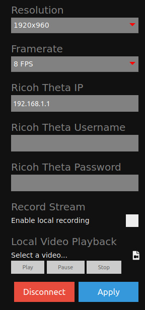

# Amelia Viewer by Jake Kenin


This is a fork of Jake Kenin's code to display LiveView video from the RICOH THETA V.  
See Jake's original [README](docs/README.original.md).


Binaries are available for Windows and Linux in the 
[releases](https://github.com/codetricity/amelia_viewer/releases) section.


I've added Electron Forge to be able to build binaries
for different platforms.



There is an active discussion on this forum [here](https://community.theta360.guide/t/successful-theta-v-stream-from-drone-to-vr-headset-0-25-miles-away/4437/). 

## RICOH THETA MotionJPEG Streaming

This is a low-framerate, low-latency method of streaming video over wifi.

Live View Specifications (Only still image capture mode) (RICOH THETA S or above)
Equirectangular data in MotionJPEG format is output.

Image size: 640x320, 1024x512*, 1920x960*

* RICOH THETA V or later


This project uses the `camera.getLivePreview` API for the RICOH THETA V.  It should
work with most RICOH THETA cameras.  The API is here reference is here:

https://api.ricoh/docs/theta-web-api-v2.1/commands/camera.get_live_preview/

The Amelia Viewer code references this code for MotionJPEG readable stream.

https://github.com/aruntj/mjpeg-readable-stream/blob/master/index.html

You can see the working code with the THETA V here:

https://github.com/codetricity/amelia_viewer/blob/137d2537a6f5408333eedc5ea15dc7298348110e/assets/js/ricoh_api.js#L218

## Other Variants of MotionJPEG Streaming Code

There are additional examples of MotionJPEG streaming at this link.

http://theta360developers.github.io/community-document/live-streaming.html#_untethered_wifi_streaming

```
...(http)
0xFF 0xD8      --|
[jpeg data]      |--1 frame of MotionJPEG
0xFF 0xD9      --|
...(http)
0xFF 0xD8      --|
[jpeg data]      |--1 frame of MotionJPEG
0xFF 0xD9      --|
...(http)
```

There is another example of parsing an mjpeg stream from an IP camera here:

https://stackoverflow.com/questions/21702477/how-to-parse-mjpeg-http-stream-from-ip-camera


