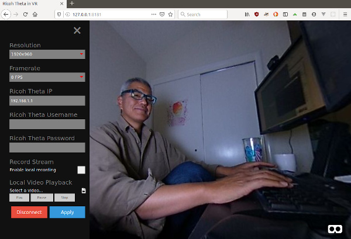

# Amelia Viewer by Jake Kenin


This is a fork of Jake Kenin's code to display LiveView video from the RICOH THETA V.  



Binaries are available for Windows and Linux in the 
[releases](https://github.com/codetricity/amelia_viewer/releases) section.


I've added Electron Forge to be able to build binaries
for different platforms.


---

Native app for viewing a 360 livestream from the Ricoh Theta in a VR headset

Built using:

* Node.js
* Electron
* A-Frame
* Three.js

### Example of `settings.json`

```
{ connection:
   { ip: '192.168.1.1', username: 'default', password: 'default' },
  video:
   { resolution_x: '1920',
     resolution_y: '960',
     fps: '30',
     record_locally: 'true',
     recording_directory: './made/up/dir' } 
}
```


### Goals

* replace the font awesome folder icon with just a regular icon, since its 
  ~1.7mb of data for just one icon...
* rename "settings_container" class to "side_menu_container" 
* Add "Exit VR" button to A-Frame view
* Combine the calls to disable sleep mode and set resolution, or create some
  framework for combining option calls
* Wrap up the API in a nice class
* Add a "Connected / Not Connected" message to the main view telling people to 
  connect using the button.
    * ~~Add a "Connect / Disconnect" button~~ 
    * ~~toggle state of the connect/disconnect button~~
    * Add message to the aframe vr display saying when we have lost connection (FPS = 0)
* Add ability to detect failure to connect to the theta 
* Make the rerender event name be imported or something so I don't just have a magic
string
* Add proper inclusions to my JS because IDK wtf I am doing 
* ~~Use `127.0.0.1` instead of `0.0.0.0`~~
* Get VR with Occulus working with electron
* Write a script or something to automate the process of making a `.MSI` file
* Handle error where a node application is not found / loaded
* Incorporate the network diagnostic functions
* Incorporate [dhcp-node](https://github.com/infusion/node-dhcp) to replace using tftpd64
   * Make it run optionally
   * Give a simple diagnostic / control application that can be launched
* ~~Add application menu~~
* ~~Reorganize code so we don't have a ton of JS code in `index.html`~~
* Write a Ricoh Theta plugin to allow for 4K @ 30 FPS
* ~~Method for stopping a stream~~
* Method to detect the stream disconnecting (0 fps for ~3s?)
    * Be sure to emit event when we DC
    * Stop recording when we DC
    * When Notify user in A-Frame
* ~~Auto reset video stream when resolution changes~~
* ~~Add recording feature~~
* ~~Actually test with Occulus lol~~
* Use `const myEvent = new Event(EVENT_NAME)` instead of creating them everytime
* Change bitrate of recorded video based on resolution and FPS
* Add [blinking recording](http://jsfiddle.net/rmq6Lt3g/1/) icon to A-Frame to 
  say when we are recording
* Light up the setting titles when we are editign their value
* Add message in upper right hand of aframe view saying we are either LIVE
  (streaming from Theta) or PLAYBACK (playing an uploaded video)
* Replace the playback buttons with play / stop icons
* Replace default scene with a message saying to either playback or begin streaming
* make the dropdown selectors not work when disabled
* Style the text box inputs and the dropdown selectors for indicating they are disabled
* change the ids of all the "download_dir" stuff to "upload_file" or something
* When we disable the file input for local playback (occurs while we are streaming)
  stop the icon from changing color on hover.
* Add playback functionality using uploaded video
    * Select file to playback
    * Create side-menu for local playback
        * Select file
        * Start playback btn
        * Stop playback btn
    * When you are playing back disable the `Apply` and `Connect` buttons
